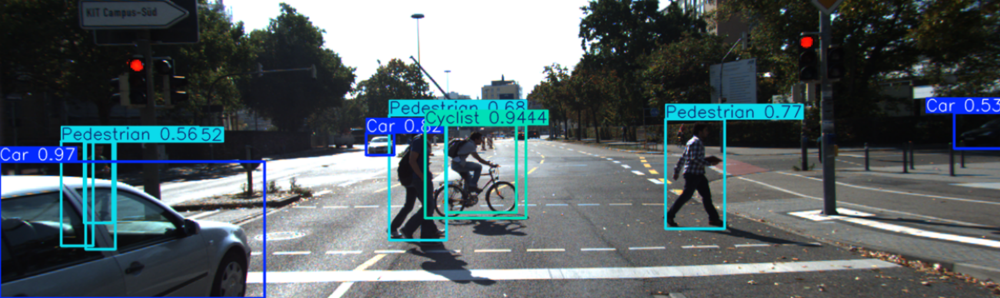

# 🚗 Autonomous Driving Object Detection using YOLOv8 and KITTI Dataset

This project applies the YOLOv8 model to detect various objects from autonomous driving scenes using the KITTI dataset. The goal is to train a deep learning model that can recognize vehicles, pedestrians, cyclists, and more in real-time scenarios.

---

## 📁 Dataset

We use the **KITTI Vision Benchmark Suite**, a popular dataset for autonomous driving, containing labeled images for object detection tasks.

### Detected Classes:
- 🚶 Pedestrian
- 🚴 Cyclist
- 🚗 Car
- 🚐 Van
- 🚛 Truck
- 🚋 Tram
- 👤 Person Sitting
- ❓ Misc
- 🚫 DontCare (ignored during training)

---

## 🧠 Model

- **Model:** YOLOv8 (You Only Look Once - Version 8)
- **Framework:** Ultralytics YOLOv8
- **Training:** Fine-tuned on the KITTI dataset
- **Input:** RGB images
- **Output:** Bounding boxes with object class and confidence score

---

## 📊 Results

### 📈 mAP and Metrics

> These results indicate strong performance in detecting core object classes, particularly cars, cyclists, and pedestrians.

---

## 🔍 Sample Predictions

The following are sample predictions generated by the trained YOLOv8 model on unseen KITTI images:

 
 
 

> The model accurately detects multiple objects such as vehicles and pedestrians with high confidence.

---

## ⭐️ Acknowledgments

- [KITTI Dataset](http://www.cvlibs.net/datasets/kitti/)
- [Ultralytics YOLOv8](https://github.com/ultralytics/ultralytics)
